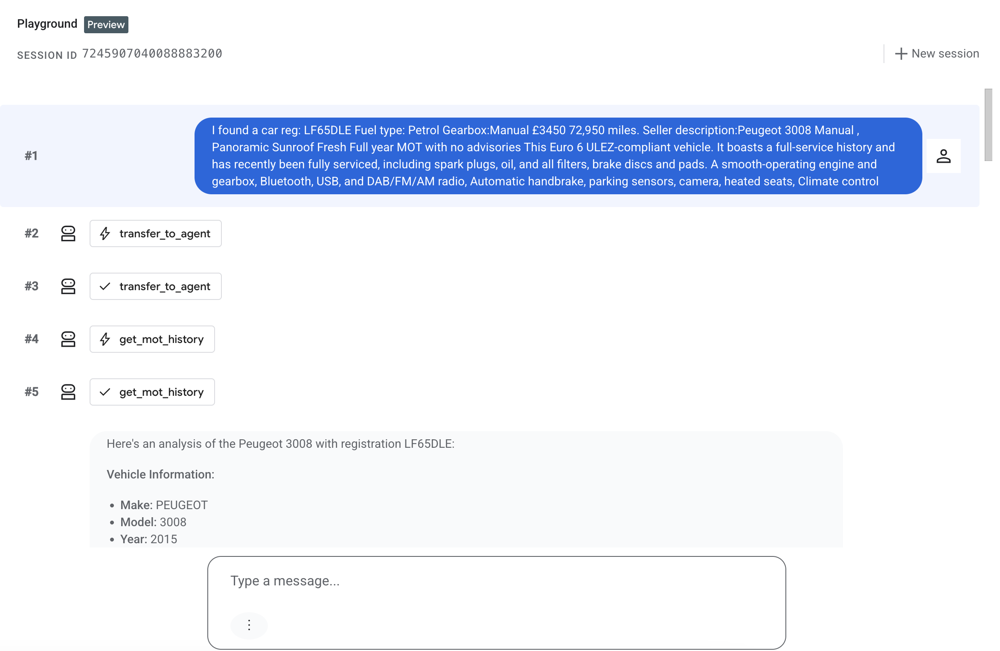
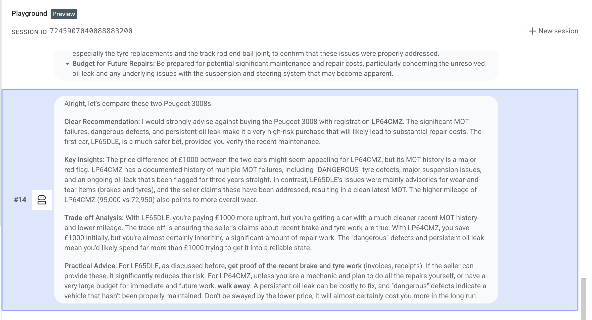
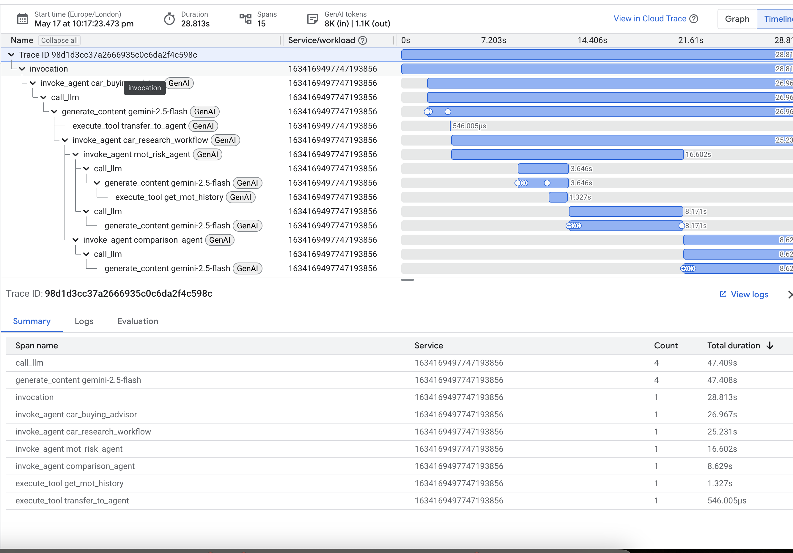

# 🚗 Car Buying Advisor — ADK + A2A + MOT MCP

A multi-agent car buying analysis system built with Google ADK and the Agent2Agent (A2A) protocol.
---

## Setup

### Install dependencies
```bash
pip install -r requirements.txt
```

### Set environment variables

```bash
# Google Gemini (for ADK agents)
export GOOGLE_API_KEY=your_gemini_api_key

# DVSA MOT History API (register at https://documentation.history.mot.api.gov.uk)
export MOT_API_KEY=your_mot_api_key
export MOT_CLIENT_ID=your_azure_client_id
export MOT_CLIENT_SECRET=your_azure_client_secret
export MOT_TENANT_ID=your_azure_tenant_id
```


### Configure ADK to use the MOT MCP Server

Create `~/.adk/mcp_config.json`:
```json
{
  "mcpServers": {
    "mot-history": {
      "command": "python",
      "args": ["/path/to/car-advisor/mcp_server/mot_mcp_server.py"],
      "env": {
        "MOT_API_KEY": "${MOT_API_KEY}",
        "MOT_CLIENT_ID": "${MOT_CLIENT_ID}",
        "MOT_CLIENT_SECRET": "${MOT_CLIENT_SECRET}",
        "MOT_TENANT_ID": "${MOT_TENANT_ID}"
      }
    }
  }
}
```


---

## Project Structure

```
TBC
```

# Setup

Proxy mcp server as start like following

```
gcloud run services proxy mcp-server --region=us-central1
```

## web run

```
uv run adk web agents --port 8080 \
    --extra_plugins google.adk.plugins.logging_plugin.LoggingPlugin
```

## Test prompt

```
I am considering following listing for a family car. please analyse with reg: FN09XUY 2009 Toyota Avensis 1.8 V-Matic TR Tourer Euro 4 5dr £3,000 Mileage:131,140 miles 2009 (09 reg) Fuel type:Petrol Body type:Estate Engine:1.8L Gearbox:Manual Seats: 5 Emission class:Euro 4
```

Another follow up
```
I have another car RV11FFK Mileage 2011 (11 reg) Fuel type: Petrol Gearbox:Manual £1,795 
```

Another follow up
```
I am considering following listing for a family car. I care reg is:OU64TXH  Gearbox:Manual £2900 
```

Another follow up peugeot 
```
I have another car LP64CMZ  Fuel type: Petrol? Gearbox:Manual £2450 95000 miles 
```


Another follow up peugeot 3008
```
I have another car LF65DLE  Fuel type: Petrol Gearbox:Manual £3450 72,950 miles. Seller description:Peugeot 3008 Manual , Panoramic Sunroof Fresh Full year MOT with no advisories This Euro 6 ULEZ-compliant vehicle. It boasts a full-service history and has recently been fully serviced, including spark plugs, oil, and all filters, brake discs and pads. A smooth-operating engine and gearbox, Bluetooth, USB, and DAB/FM/AM radio, Automatic handbrake, parking sensors, camera, heated seats, Climate control

```

## Deployment

Agent Deployment

```
  python3 deployment/deploy.py --action deploy 
```


## Screenshots




